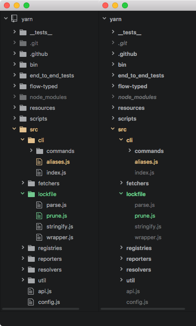

hide-tree-view-icons
====================

* Hides the folder and file icons in Atom's Tree View and Nuclide's File Tree.
* Increases the contrast between folders and files.
* Highlights folders on hover.
* Ignored items are italicized.

```
$ apm install hide-tree-view-icons
```



